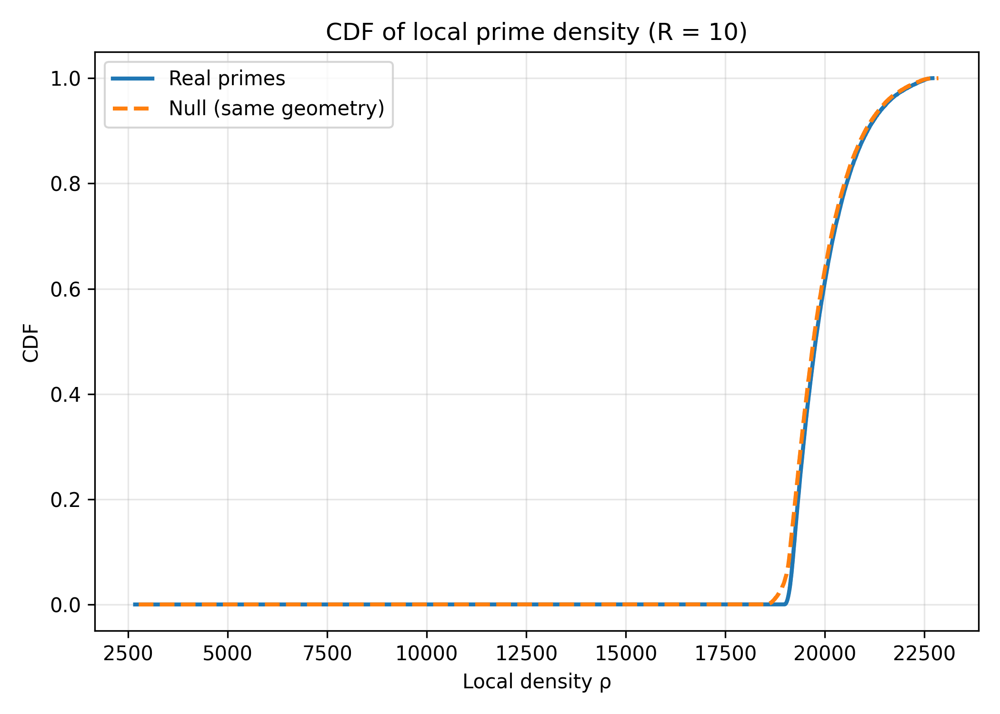
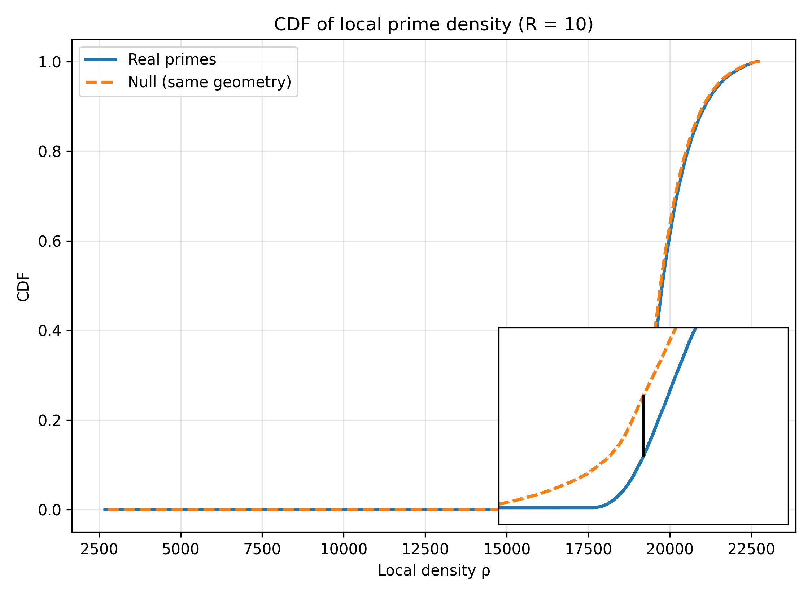
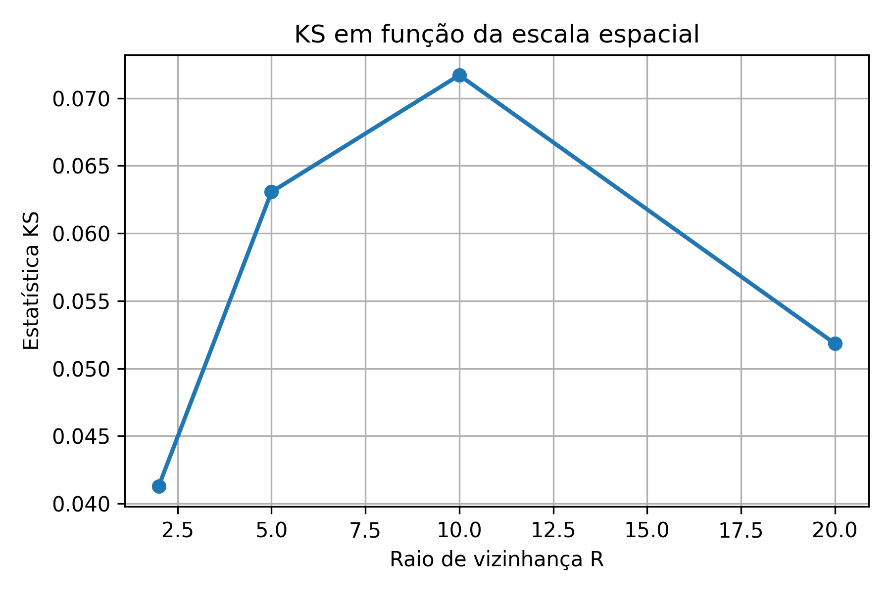
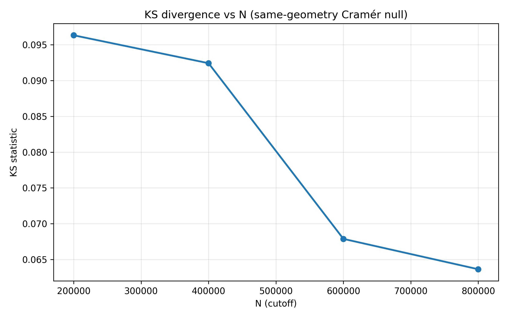

# Geometric Null Models for Prime Distributions

This repository accompanies the manuscript:

**Residual Spatial Correlations in Geometric Embeddings of Prime Numbers**  
Manuscript in preparation (2026)

---

## Overview

This project investigates the spatial organization of prime numbers through a continuous geometric embedding of the natural numbers into a logarithmic spiral. Within this geometric representation, we define local prime densities based on Euclidean neighborhoods and analyze their statistical properties across multiple spatial scales.

To assess whether observed local structures can be explained solely by geometric effects and by the average rarefaction of primes, we introduce a **geometric null model inspired by Cramér’s probabilistic model**. In this null configuration, the embedding geometry and global intensity are preserved, while arithmetic correlations are removed via independent Bernoulli sampling.

Comparisons between the real prime distribution and the null model are performed using non-parametric statistical tests, revealing residual spatial correlations at mesoscopic scales.

---

## Scientific goals

- Embed natural numbers and primes in a continuous geometric space
- Define and measure local prime density using spatial neighborhoods
- Construct a calibrated geometric null model of Cramér type
- Compare real and null configurations using distribution-level statistics
- Identify scale-dependent residual spatial correlations

---

## Repository structure

```
geometric-null-model-primes/
│
├── README.md
├── LICENSE
├── LICENSEdoc
├── CITATION.cff
│
├── data/
│   ├── E1_base_log_espiral_1M.csv
│   ├── null_on_real_embedding.csv
│   └── radius_sweep_real_embedding.csv
│
├── scripts/
│   ├── generate_embedding.py
│   ├── generate_null_on_real_embedding.py
│   ├── compare_density_on_sampled_points_realembed.py
│   ├── sweep_radius_density_real_embedding.py
│   └── utils/
│       ├── primality.py
│       ├── geometry.py
│       └── sampling.py
│
├── figures/
│   ├── fig_real_vs_null_embedding_side_by_side.png
│   ├── fig_cdf_real_vs_null_R10.png
│   ├── fig_cdf_real_vs_null_R10_KS_zoom.png
│   ├── fig_ks_vs_radius_real_embedding.png
│   └── KS_vs_N_caps.png
│
├── paper/
│   ├── manuscript.docx
│   ├── manuscript.pdf
│   └── figures/
│
├── notebooks/
│   └── exploratory_analysis.ipynb
│
└── requirements.txt
```

---

## Installation

Clone the repository and install dependencies:

```bash
git clone https://github.com/SEU_USUARIO/geometric-null-model-primes.git
cd geometric-null-model-primes
pip install -r requirements.txt
```

Python ≥ 3.9 is recommended.

---
## Experimental Pipeline and Interpretation

This project is organized as a sequence of numbered experiments. 
Each experiment produces well-defined outputs that serve as inputs for subsequent stages. 
Together, they allow a controlled investigation of local spatial structure in the geometric distribution of prime numbers.

### First of all: E1 — Generation of the geometric embedding (base dataset)

### E1 — Objective
To construct a continuous geometric embedding of the natural numbers into a logarithmic spiral and to identify the real prime numbers within the analyzed interval. 
This experiment defines the fixed geometric space used throughout the project.


```bash
python E1_generate_log_spiral_dataset_min.py \
  --N 1000000 \
  --b 0.1 \
  --radius_mode adaptive \
  --z_factor 0.1 \
  --block_size 50000 \
  --percentile 95 \
  --out_csv data/E1_base_log_espiral_1M.csv
```

### E1 — Output
`data/E1_base_log_espiral_1M.csv`

-The output directory (/data) is created by the script.

### Typical columns include:

n — natural number

x, y — geometric coordinates

is_prime — arithmetic label (1 if prime, 0 otherwise)

### E1 — Interpretation
This experiment fixes the geometry of the problem. Primes and composite numbers share the same embedding. No statistical hypothesis is tested at this stage; the output simply defines the spatial domain in which all subsequent analyses are performed.

E1 — Notes

-This dataset is intentionally comprehensive. In addition to the features required for the present work, it also includes auxiliary features originally developed for a previous project on prime density halos. These additional features are not used in the current analysis.

-The same base dataset is reused across subsequent projects, ensuring consistency of the geometric embedding and facilitating comparative studies.

---

### E2 — Construction of the geometric null model (Cramér-type)

### E2 — Objective
To generate a statistically controlled null configuration that preserves geometry and global intensity while removing arithmetic correlations among primes.

### E2 — Script
```bash
python generate_null_on_real_embedding.py
```

### E2 — Input

Base dataset generated in E1 : `data/E1_base_log_espiral_1M.csv`

### E2 — Probability model

!!! Colocar uma breve explicação sobre a formula
O que c significa e os valores. E o que o n significa. !!!

```r
p(n) = c / log(n)
```

### E2 — Output
`data/null_on_real_embedding.csv`

- Typical terminal output:
```bash
Real primes: 78498 | Null events: 78207 | c = 0.9983
```

### E2 — Interpretation

The null model:

- uses exactly the same geometric coordinates as the real data,

- matches the total number of events,

- reproduces the large-scale rarefaction of primes,

- removes all arithmetic correlations via independent Bernoulli sampling.

- This experiment defines the main null hypothesis of the study.

---

### E3 - Compare local densities (reference scale)

Esse script responde uma única pergunta:

-“As distribuições de densidade local real e nula são estatisticamente compatíveis?”

```bash
python scripts/compare_density_on_sampled_points_realembed.py
```

This script/ Procedure:
- samples spatial centers from the full embedding,
- computes local densities for real and null configurations using KDTree radius queries,
- performs Kolmogorov–Smirnov tests,

### E3 — Output

- Typical terminal output:
```bash
==== Density on sampled points (same geometry) ====
Mean density (real): 19971.474
Mean density (null): 19901.518

KS test:
KS statistic = 0.0717
p-value      = 3.31e-112
```
- This provides direct evidence of residual spatial structure beyond the null model.
- ¿Por Qué? Explicar quais números são vistos e como determinamos isso. O que é bom e ruim neste contexto.

### E3 - part 2 - Visualizing

- generates CDF figures used in the manuscript.

```bash
python scripts/plot_cdf_real_vs_null.py
```


and

```bash
python scripts/plot_cdf_real_vs_null_with_KS_and_zoom.py
```


### E3 - part 2 - Interpretation

- Mean local densities coincide by construction (correct calibration).

- The full empirical distributions differ significantly. Como se eles fossem quase iguais?

- The maximum vertical separation between the CDFs corresponds to the KS statistic.

---

### E4 - Multi-scale robustness analysis

### E4 - Objective

To assess how the discrepancy between real and null configurations depends on the spatial scale.

Script
```bash
python scripts/sweep_radius_density_real_embedding.py
```

### E4 - Procedure

Repeat the density comparison for multiple R:
```css
R in {2, 5, 10, 20}
```

### E4 - This script:
- repeats the density comparison across multiple R,
- computes KS statistics as a function of scale,
- saves results to `data/radius_sweep_real_embedding.csv`,

### E4 - Outputs
`data/radius_sweep_real_embedding.csv`

R=  2.0: mean(real)=2898.05 | mean(null)=2884.38 | KS=0.0413 | p=1.72e-37
R=  5.0: mean(real)=9337.79 | mean(null)=9299.54 | KS=0.0631 | p=7.20e-87
R= 10.0: mean(real)=19971.47 | mean(null)=19901.52 | KS=0.0717 | p=3.31e-112
R= 20.0: mean(real)=45468.66 | mean(null)=45327.84 | KS=0.0518 | p=7.87e-59

### E4 - Interpretation

- The null hypothesis is rejected at all tested scales.
  - At all tested radii, the Kolmogorov–Smirnov test strongly rejects the null hypothesis (p ≪ 10⁻⁶), indicating statistically incompatible distributions.

- The KS statistic peaks at intermediate R (R ≈ 10).

- Small scales probe immediate proximity.

- Large scales are dominated by spatial averaging.

- The peak identifies a mesoscopic regime (intermediate-scale) where residual correlations are most pronounced.

### E4 – Interpretation - Extended notes

At all tested radii, the null hypothesis is strongly rejected, as indicated by
extremely small p-values (p ≪ 10⁻⁶) in the Kolmogorov–Smirnov test. This confirms
that the empirical distributions of local density for the real and null
configurations are statistically incompatible across all considered scales.

The magnitude of the discrepancy, however, is scale-dependent. The KS statistic
reaches its maximum at intermediate radii (R ≈ 10 in the present experiment),
indicating a regime in which residual spatial correlations are most pronounced.

At small radii, neighborhoods probe immediate proximity and are dominated by
discreteness and local rarefaction effects. At large radii, spatial averaging
progressively smooths out local fluctuations, reducing sensitivity to residual
correlations.

The peak of the KS statistic therefore identifies a mesoscopic regime, defined
relative to the explored range of scales rather than by an absolute spatial size.


### E4 - part 2 - Generates the KS × R figure

- Generates the KS × R figure

```bash
python scripts/plot_ks_vs_radius_real_embedding.py
```



---

### Supplementary experiment — Stability under increasing N

### Supplementary experiment — Objective

To verify that the observed discrepancies are not artifacts of a specific cutoff size.

### Supplementary experiment — Output
`figures/KS_vs_N_caps.png`


Figure S1.
Kolmogorov–Smirnov divergence between the empirical distributions of local prime
density for the real configuration and the same-geometry Cramér null model,
as a function of the cutoff N.
The KS statistic remains strictly positive and statistically significant across
all tested values of N, while decreasing smoothly as the domain size increases.
This behavior indicates that the observed discrepancy is not a finite-size (cutoff)
artifact, but rather reflects residual spatial correlations that are progressively
diluted by spatial averaging in larger domains.

### Supplementary experiment — Interpretation

- The effect persists as N increases.

- The observed structure is stable under domain expansion.
---

### Supplementary experiment — Stability under increasing domain size (N)

To assess whether the detected discrepancy between the real prime configuration
and the same-geometry Cramér null model is an artifact of a specific cutoff,
we performed a robustness analysis under systematic expansion of the domain size N.

For each cutoff N ∈ {200k, 400k, 600k, 800k}, we:

1. Restrict the geometric embedding to the first N natural numbers.
2. Recalibrate a same-geometry Cramér-type null model on this restricted domain.
3. Sample spatial centers uniformly from the embedding.
4. Compute local prime densities using a fixed neighborhood radius (R = 10).
5. Compare real and null density distributions using the Kolmogorov–Smirnov test.

The resulting KS statistics remain clearly positive and statistically significant
for all tested values of N, while decreasing smoothly as N increases.

This behavior indicates that the observed discrepancy is not a finite-size or
boundary artifact. Instead, it reflects residual spatial correlations whose
relative magnitude is gradually diluted by spatial averaging as the domain grows.

The persistence and smooth decay of the KS statistic under increasing N provide
strong evidence for the stability of the detected effect.

---

Conceptual summary

| Experiment    | Role                        |
| ------------- | --------------------------- |
| E1            | Defines the geometry        |
| E2            | Defines the null hypothesis |
| E3            | Detects local discrepancies |
| E4            | Tests scale robustness      |
| Supplementary | Verifies stability          |

---
### Key takeaway

- If the geometric null model were sufficient, the empirical density distributions of the real and null configurations would be statistically indistinguishable at all scales. The systematic rejection of the null hypothesis, particularly at intermediate scales, demonstrates the presence of residual spatial correlations in the geometric distribution of prime numbers.
---

## Figures

All figures appearing in the manuscript are generated by scripts in `scripts/` and saved in `figures/`:

- **Figure 1** — Geometric embedding and neighborhood illustration  
- **Figure 2** — Real vs null configuration (same geometry, side by side)  
- **Figure 3** — CDF of local densities at \( R = 10 \)  
- **Figure 3b** — Zoomed CDF with KS statistic highlighted  
- **Figure 4** — KS statistic as a function of neighborhood radius  
- **Supplementary** — KS vs cutoff experiments

---

## Methodological notes

- Local densities are **not evaluated exclusively at prime locations**, in order to avoid autoconditioning bias.
- All comparisons preserve:
  - embedding geometry,
  - global event intensity,
  - large-scale rarefaction.
- Statistical comparisons are performed on full empirical distributions, not only on mean values.

---

## Citation

If you use this code or build upon this work, please cite the accompanying manuscript.  
A `CITATION.cff` file is provided for automatic citation tools.

---

## License

- Code (Python scripts, shell, etc.): **MIT License** (see `LICENSE`).
- Article text, documentation and explanatory figures: **CC BY 4.0**  
  © 2025 **Taciana Gomes**. You may share and adapt the material, provided appropriate credit is given.

---

## Contact

**Taciana Gomes**  
Independent researcher  
GitHub: https://github.com/tacigomess
